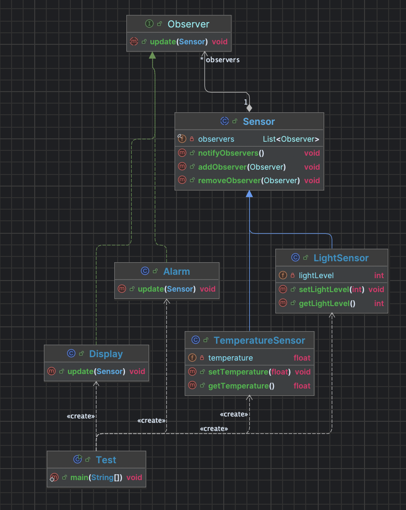

# Dokumentation der Implementierung von Observer und State Pattern

## Projektname: IoT Sensoren

**Autor:** Julius Lange, Ian Risch

**Datum:** 2024/11/29

**Kurs:** BS IT 22a

---

# Inhaltsverzeichnis

1. [Einleitung](#einleitung)
2. [Theoretische Grundlagen](#theoretische-grundlagen)
    1. [Observer Pattern](#observer-pattern)
    2. [State Pattern](#state-pattern)
3. [UML-Diagramme](#uml-diagramme)
    1. [Klassendiagramm: Observer Pattern](#klassendiagramm-observer-pattern)
    2. [Zustandsdiagramm: State Pattern](#zustandsdiagramm-state-pattern)
4. [Quellcode](#quellcode)
    1. [Observer Pattern](#observer-pattern-code)
    2. [State Pattern Code](#state-pattern-code)
5. [Quellen](#quellen)

---

## Einleitung

In diesem Projekt werden zwei Entwurfsmuster, das **Observer Pattern** und das **State Pattern**, verwendet, um das Verhalten und die Zustände von IoT-Sensoren (wie Temperatur- und Lichtsensoren) zu modellieren. Das Observer Pattern wird verwendet, um Benachrichtigungen an mehrere Beobachter zu senden, während das State Pattern dazu dient, unterschiedliche Zustände eines Sensors zu verwalten und das Verhalten basierend auf dem aktuellen Zustand zu ändern.

---

## Theoretische Grundlagen

### Observer Pattern

Das **Observer Pattern** ist ein Entwurfsmuster, das verwendet wird, wenn eine Klasse (Subjekt) ihre Zustandsänderungen mehreren abhängigen Klassen (Beobachtern) mitteilen muss, ohne dass diese Klassen direkt miteinander verbunden sind. Es bietet eine lose Kopplung zwischen dem Subjekt und den Beobachtern und stellt sicher, dass alle Beobachter benachrichtigt werden, wenn sich der Zustand des Subjekts ändert.

#### Anwendungsfall in diesem Projekt:
- **Subjekt:** Die Sensoren (z. B. Temperatur- und Lichtsensoren) fungieren als Subjekte, die ihre Daten überwachen und ändern können.
- **Beobachter:** Die Beobachter (z. B. ein Display oder Alarm) reagieren auf Änderungen der Sensordaten.

#### Vorteile des Observer Patterns:
- **Lose Kopplung:** Beobachter sind vom Subjekt unabhängig und benötigen keine direkte Verbindung.
- **Flexibilität:** Es können beliebig viele Beobachter hinzugefügt oder entfernt werden.
- **Echtzeit-Benachrichtigungen:** Beobachter werden sofort über Änderungen benachrichtigt.
---

## UML-Diagramm

### Klassendiagramm: 

